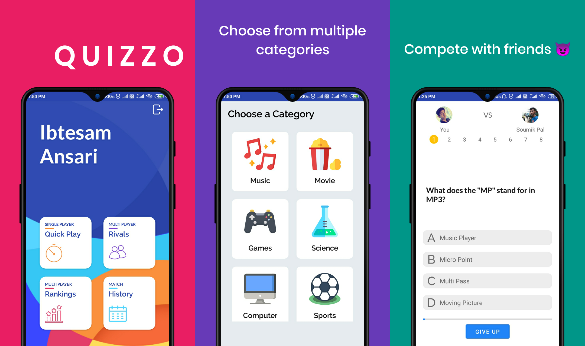
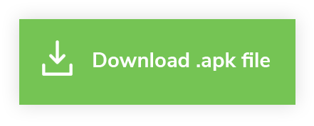

# Quizzo
> A Quiz App. 


Quizzo is a quiz app made using Kotlin. It uses the Android Jetpack libraries along with MVVM architecture pattern.



## Download

You can download the apk using the below link

[](https://firebasestorage.googleapis.com/v0/b/personal-4f912.appspot.com/o/Quizzo.apk?alt=media&token=f9d75829-11f4-4ae1-a419-8528ffb74280)


## Installation

1. Clone the repo
2. Create a new [Firebase Project](https://console.firebase.google.com) and download ```google-services.json``` file and copy it in ```/app``` folder
3. Goto ```/app/src/main/java/quizzo/app/Contract.kt``` and put in your credentials
    ```sh
        const val QUIZZO_SERVER_URL= "<--Enter your Quizzo api url here-->"
        const val WRITE_KEY= "<--Enter the R/W access key for your database-->"
    ```
    Check out [Quizzo-Server](https://github.com/ibtesam123/Quizzo-Server) for details.
4. Add your app's `SHA1` in your Firebase Project.
5. Run the app

## Meta

Ibtesam Ansari – [LinkedIn](https://www.linkedin.com/in/ibtesamansari/) – ibtesamansari070@gmail.com

[https://github.com/ibtesam123](https://github.com/ibtesam123)

## Contributing

1. Fork it (<https://github.com/ibtesam123/Quizzo/fork>)
2. Create your feature branch (`git checkout -b feature/fooBar`)
3. Commit your changes (`git commit -m 'Add some fooBar'`)
4. Push to the branch (`git push origin feature/fooBar`)
5. Create a new Pull Request


## License

All the code available under the MIT license. See [LICENSE](LICENSE).

```sh
MIT License

Copyright (c) 2020 Ibtesam Shaukat Ansari

Permission is hereby granted, free of charge, to any person obtaining a copy
of this software and associated documentation files (the "Software"), to deal
in the Software without restriction, including without limitation the rights
to use, copy, modify, merge, publish, distribute, sublicense, and/or sell
copies of the Software, and to permit persons to whom the Software is
furnished to do so, subject to the following conditions:

The above copyright notice and this permission notice shall be included in all
copies or substantial portions of the Software.

THE SOFTWARE IS PROVIDED "AS IS", WITHOUT WARRANTY OF ANY KIND, EXPRESS OR
IMPLIED, INCLUDING BUT NOT LIMITED TO THE WARRANTIES OF MERCHANTABILITY,
FITNESS FOR A PARTICULAR PURPOSE AND NONINFRINGEMENT. IN NO EVENT SHALL THE
AUTHORS OR COPYRIGHT HOLDERS BE LIABLE FOR ANY CLAIM, DAMAGES OR OTHER
LIABILITY, WHETHER IN AN ACTION OF CONTRACT, TORT OR OTHERWISE, ARISING FROM,
OUT OF OR IN CONNECTION WITH THE SOFTWARE OR THE USE OR OTHER DEALINGS IN THE
SOFTWARE.
```